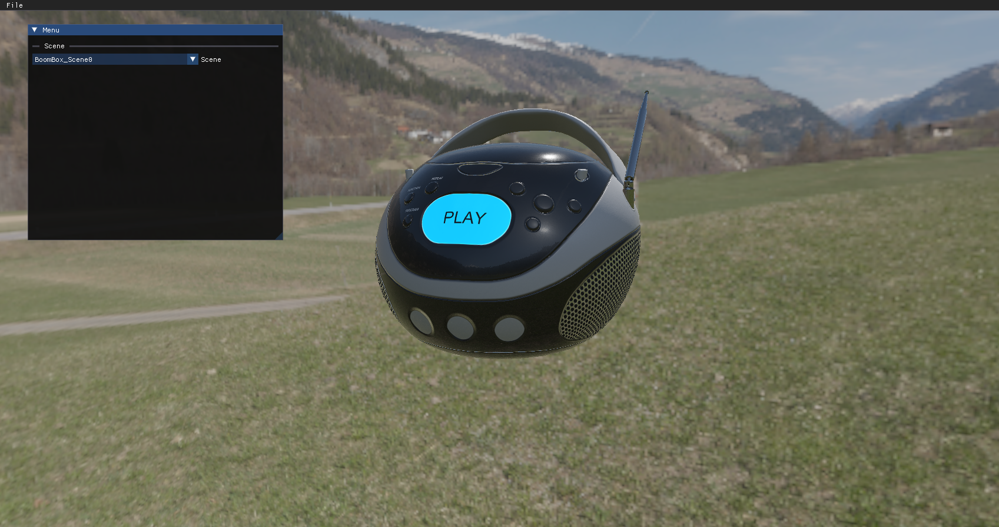
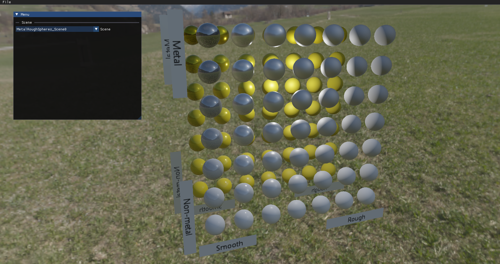

# Vulkan Engine

A 3D Rendering Software just to learn and practice implementing various Vulkan and 3D rendering code.

## Current Features

- Implements Bindless Rendering Design
- GLTF Model/Scene Loading
- PBR + IBL Based Rendering

## Third Party Libraries Used
- Imgui
- VkBootStrap
- GLM
- VMA
- SDL
- FastGLTF
